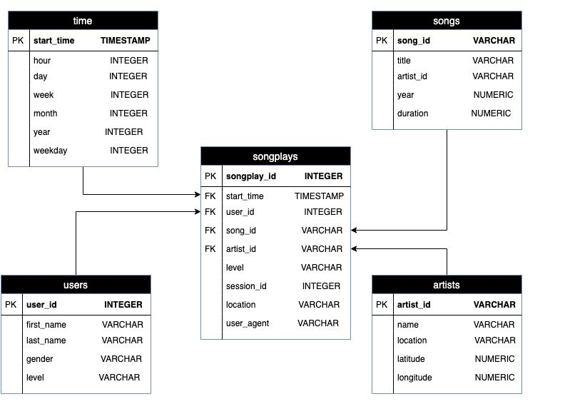

# Project: Data Modeling with Postgres

## Introduction
A startup called Sparkify wants to analyze the data they've been collecting on songs and user activity on their new music streaming app. The analytics team is particularly interested in understanding what songs users are listening to. Currently, they don't have an easy way to query their data, which resides in a directory of JSON logs on user activity on the app, as well as a directory with JSON metadata on the songs in their app.

They'd like a data engineer to create a Postgres database with tables designed to optimize queries on song play analysis, and bring you on the project. Your role is to create a database schema and ETL pipeline for this analysis. You'll be able to test your database and ETL pipeline by running queries given to you by the analytics team from Sparkify and compare your results with their expected results.

## Project Description
ETL pipeline that transfers data from the files into Postgres tables using Python and SQL.

## Database schema design
The schema used is a star schema:
# ER diagram


## ETL process
The ETL pipeline is structured as below:
1. Connects to the database sparkifydb and creates the tables songs, artists, time, users and songplays
2. Read data/song_data json files and stores the data in songs and artists tables
3. Read data/log_data json files and stores the data in time, users and songplays tables

## Files in repository
```
├── create_tables.py
├── data
│   ├── log_data
│   └── song_data
├── er_diagram.jpg
├── etl.ipynb
├── etl.py
├── README.md
├── sql_queries.py
└── test.ipynb
```

## How to run the python scripts
1. Create Postgres tables
    ```bash
    $ python create_tables.py
    ```


2. Run the ETL pipelines
    ```bash
    $ python etl.py
    ```