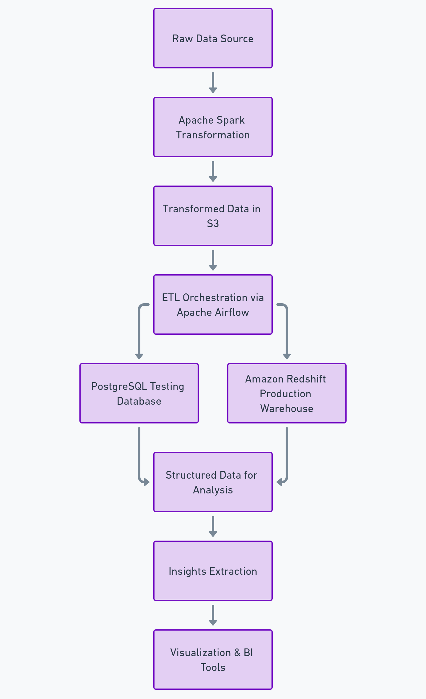

# Music Analytics Project

## Overview
The Music Analytics Project is designed to process and analyze raw music streaming data at scale. By leveraging Python, Apache Spark, Airflow, PostgreSQL, and Amazon Redshift, the project constructs a structured data pipeline to transform raw input data into a form suitable for extracting insights. This serves as a foundation for understanding user behavior, song popularity, and other analytical use cases.

---

## Key Features
- **Automated Database Management**: Reusable table schema designs simplify database setup.
- **Scalable Data Processing**: Apache Spark handles large-scale transformations for efficient computation.
- **Orchestrated Pipelines**: Apache Airflow automates ETL pipeline execution and scheduling.
- **Optimized for Analytics**: Amazon Redshift enables high-performance querying on large datasets.
- **Business Intelligence Support**: Provides structured data for visualization and advanced analytics.

---

## Technologies

| Technology       | Purpose                                                                 |
|------------------|-------------------------------------------------------------------------|
| **Python**       | Orchestrates automation of the ETL lifecycle and interacts with databases. |
| **Apache Spark** | Performs distributed transformations on large datasets for preprocessing. |
| **PostgreSQL**   | Manages schemas and serves as a local testing database.                 |
| **Amazon Redshift** | Scalable data warehouse for production analytics workloads.             |
| **SQL**          | Defines and queries structured data for insights.                      |
| **Apache Airflow** | Automates data pipeline orchestration and scheduling.                   |
| **ConfigParser** | Manages sensitive configurations for portability and security.          |

---

## Project Structure

```
Music Analytics/
│
├── airflow/
│   ├── dags/
│   │   ├── create_song_tables.py       # Script to build schemas in Redshift
│   │   ├── load_song_to_redshift.py    # Loads data from S3 to Redshift
│   │   └── music_analytics_dag.py      # Main Airflow DAG for the ETL pipeline
│   ├── plugins/
│   │   ├── helpers/
│   │   │   └── sql_queries.py          # All SQL queries for Redshift
│   │   └── operators/
│   │       ├── data_quality.py         # Checks data integrity in Redshift
│   │       ├── load_dimension.py       # Loads dimension tables in Redshift
│   │       ├── load_fact.py            # Loads fact tables in Redshift
│   │       └── stage_redshift.py       # Stages data from S3 to Redshift
│   └── create_tables.sql               # SQL definitions to create tables in Redshift
│
├── AWS/
│   ├── create_tables.py                # Standalone script to create Redshift tables
│   ├── dwh.cfg                         # Configuration for AWS credentials, cluster details
│   ├── er_diagram.jpg                  # ER diagram for visual reference
│   ├── etl.py                          # ETL script to move data from S3 into Redshift
│   ├── log-data.png                    # Example log-data visual or sample
│   ├── README.md                       # AWS-specific instructions
│   └── sql_queries.py                  # SQL queries (create, insert, etc.)
│
└── Spark/
    ├── dl.cfg                          # Configuration for Spark and AWS details
    ├── etl.py                          # Spark script for large-scale transformations
    └── README.md                       # Usage instructions for Spark-based jobs
```

---

## Workflow



### Table Creation:
Use `create_tables.py` to initialize the database schema for incoming data.

```sql
CREATE TABLE IF NOT EXISTS songs (
    song_id    VARCHAR PRIMARY KEY,
    title      VARCHAR NOT NULL,
    artist_id  VARCHAR NOT NULL,
    artist_name VARCHAR,
    year       INT,
    duration   FLOAT NOT NULL
);
```

### Data Transformation (Apache Spark):
Transform raw song and log data into a cleansed and structured format.

```python
raw_data = spark.read.json("s3://data-source/song_data.json")
transformed_data = raw_data.select("song_id", "title", "artist_id", "duration").where(raw_data.song_id.isNotNull())
transformed_data.write.parquet("s3://output-bucket/transformed_songs/")
```

### ETL Pipeline Orchestration (Apache Airflow):
Use Airflow DAGs to automate pipeline execution.

```python
with DAG('music_analytics_etl',
         start_date=datetime(2023, 1, 1),
         schedule_interval='@daily') as dag:

    extract_task = PythonOperator(task_id='extract', python_callable=extract_data)
    transform_task = PythonOperator(task_id='transform', python_callable=transform_data)
    load_task = PythonOperator(task_id='load', python_callable=load_to_redshift)

    extract_task >> transform_task >> load_task
```

### Data Loading:
Use an `etl.py` script to load cleansed data into Amazon Redshift or PostgreSQL.

### Analysis:
Query the data warehouse to extract insights:

```sql
SELECT song_id, COUNT(*) AS play_count
FROM songplays
GROUP BY song_id
ORDER BY play_count DESC
LIMIT 5;
```

---

## How to Run the Project

### Install Dependencies
Ensure the following are installed:
- Python 3
- Apache Spark
- PostgreSQL or Amazon Redshift
- Apache Airflow

### Setup Configuration
For AWS, update `dwh.cfg` with your credentials:

```ini
[CLUSTER]
host=redshift-cluster-url
dbname=dev
user=username
port=5439
```

### Initialize the Database
Run the appropriate script to create the tables:

```bash
python create_tables.py
```

### Run the ETL Pipeline
Execute the ETL process:

```bash
python etl.py
```

### Execute Airflow DAGs
Trigger the DAG via Airflow:

```bash
airflow dags trigger music_analytics_etl
```

---

## Insights Extracted
This project enables:
- Identification of popular songs and artists.
- Analysis of user behavior from activity logs.
- Tracking trends in music consumption.
- Data preparation for recommendation systems.
