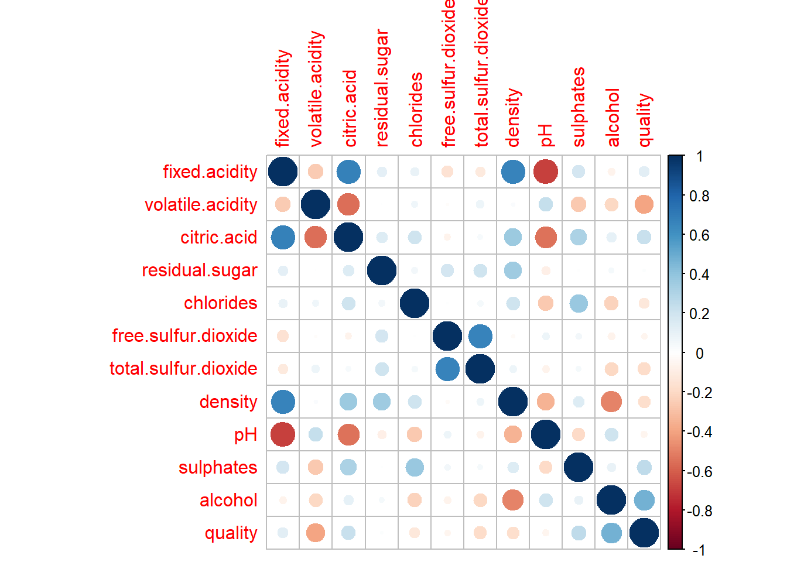

This repository contains an R-based analysis of the chemical properties of red wines, 
specifically focusing on how these properties influence overall wine quality. 
The goal is to identify which chemical features—such as acidity, sulphates, 
and alcohol content—are most strongly correlated with higher-quality wines.

---

## Project Overview

The analysis is conducted using a dataset of red wines with 1,599 observations 
and 11 chemical variables (plus a quality variable). By exploring univariate, 
bivariate, and multivariate relationships, this project aims to uncover 
meaningful correlations between chemical properties and wine quality.

Key findings of the analysis include:
- **Alcohol** content shows the strongest positive correlation with wine quality.
- **Volatile acidity** negatively correlates with wine quality.
- **Sulphates** also show a positive correlation with quality, 
  likely due to their role in preventing microbial spoilage.
- **Citric acid** has a weaker positive correlation, while 
  **fixed acidity** shows a modest positive relationship to quality.

---

## Repository Structure

```
.
├── README.md            # Project description and setup instructions
├── wineQualityReds.csv  # CSV file containing the red wine dataset
└── analysis.Rmd         # Primary R Markdown file with the full analysis code
```

---

## Getting Started

### Prerequisites

To replicate this analysis, ensure you have the following installed:

1. **R** (version 4.0 or later recommended)
2. **RStudio** (optional but recommended for ease of use)
3. **R packages**:
   - **ggplot2**
   - **grid**
   - **gridExtra**
   - **GGally**
   - **corrplot**

You can install any missing packages with:
```r
install.packages(c("ggplot2", "grid", "gridExtra", "GGally", "corrplot"))
```

### How to Run

1. **Clone or download** this repository to your local machine.
2. **Open** the `analysis.Rmd` file in RStudio (or a similar environment).
3. **Set your working directory** to the folder containing `analysis.Rmd` and 
   `wineQualityReds.csv`.
4. **Knit** or **Run** all the code chunks in `analysis.Rmd`.

> **Note**: If your environment does not support R Markdown knitting, you can 
> copy the relevant code from each section into your R console or script 
> and run them sequentially.

---

## Data

- **File**: `wineQualityReds.csv`
- **Dimensions**: 1,599 rows × 12 columns (11 chemical variables + quality variable)
- **Variables** include (but are not limited to):
  - `fixed.acidity`
  - `volatile.acidity`
  - `citric.acid`
  - `residual.sugar`
  - `chlorides`
  - `free.sulfur.dioxide`
  - `total.sulfur.dioxide`
  - `density`
  - `pH`
  - `sulphates`
  - `alcohol`
  - `quality` (an integer rating from 1–10)

---


## Analysis Outline

1. **Load Packages**  
   All required packages (e.g., `ggplot2`, `corrplot`) are loaded at 
   the beginning of the script.

2. **Load the Data**  
   The dataset is read from `wineQualityReds.csv` into an R object called 
   `redwines`. A quick check is done to confirm the shape of the data 
   and ensure that the file does not contain extraneous columns.

3. **Univariate Analysis**  
   - **Histogram plots** and **boxplots** are used to explore the distribution 
     of each chemical property.
   - Transformations (like log-transform) are considered to address skewness 
     in certain variables.

4. **Bivariate Analysis**  
   - **Correlation matrix** (using `corrplot`) to identify the strength and 
     direction of relationships between variables.
   - **Boxplots** by quality category (bad, average, good) for key variables 
     like alcohol, acidity, sulphates.
   - Investigation of how different chemical properties align with 
     (or differ from) wine quality.

5. **Multivariate Analysis**  
   - Several **facet plots** to examine interactions among multiple 
     predictors (e.g., alcohol vs. sulphates vs. volatile acidity), 
     colored or faceted by the wine quality rating.

6. **Conclusions & Future Work**  
   - Highlights of the significant correlations (alcohol, sulphates, 
     volatile acidity, citric acid).
   - Suggestions for further data collection (e.g., taste and aroma scores, 
     price information) for a more robust understanding of overall wine quality.

---

## Key Results

1. **Alcohol**: Shows the highest positive correlation with wine quality 
   (about 0.48). Good-quality wines generally have higher alcohol content.
2. **Volatile Acidity**: Has a negative correlation with quality 
   (around -0.39). Wines with lower volatile acidity tend to be rated higher.
3. **Sulphates**: Positively correlated with quality, likely due to 
   their role in preventing spoilage and preserving flavor.
4. **Citric Acid**: Demonstrates a mild positive correlation, 
   though many wines have zero citric acid.
5. **Acidic Properties & pH**:  
   - Fixed acidity and citric acid show some positive relationships with quality.
   - pH, however, did not exhibit a strong correlation with overall wine quality.

---

## References

1. [Wikipedia on Wine](https://en.wikipedia.org/wiki/Wine)  
2. [Wine Folly: Wine Characteristics](http://winefolly.com/review/wine-characteristics/)  
3. [The Guardian: Wine Alcohol Strength Understated](https://www.theguardian.com/lifeandstyle/2011/jul/05/wine-alcohol-strength-understated)

---

## License

This project is released under the MIT License. For more details, 
see [LICENSE](LICENSE).

---

### Contact

If you have any questions or suggestions, feel free to open an issue or 
submit a pull request. We welcome contributions and feedback!
